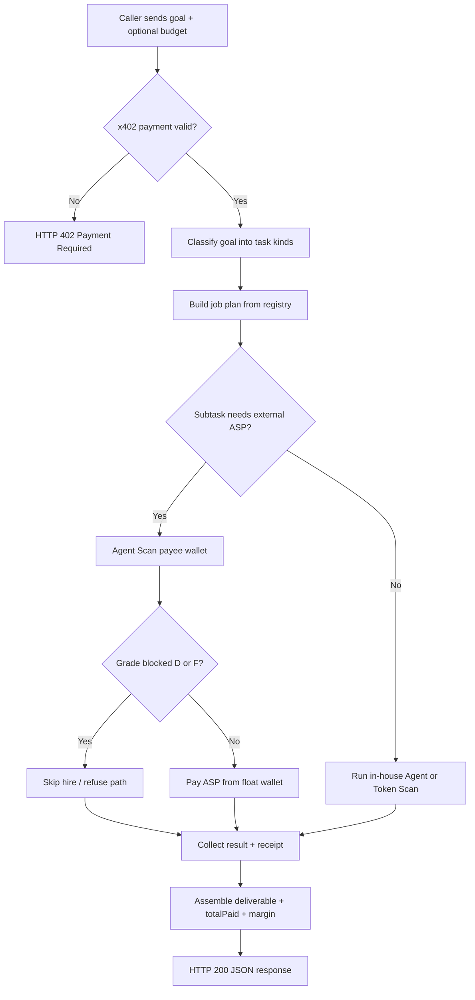
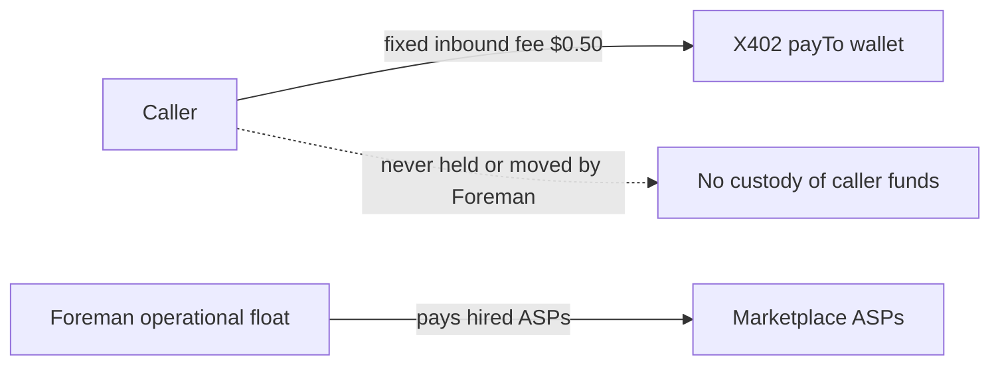
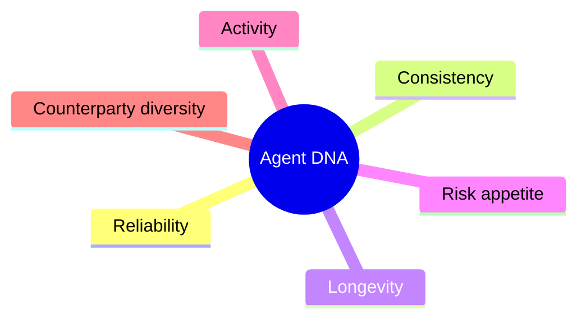

# Foreman

**The employer of the agent economy.**

<p align="center">
  
</p>

<p align="center">
  <strong>One goal. One budget. Verified hires. Onchain receipts.</strong><br/>
  <a href="https://agentdnas.vercel.app">Live product</a>
  ·
  <a href="https://agentdnas.vercel.app/llms.txt">llms.txt</a>
  ·
  X Layer (eip155:196)
  ·
  MIT
</p>

---

## What this is

**Foreman** is an Agent Service Provider (A2MCP) for the [OKX.AI](https://www.okx.com/) marketplace. Other agents pay it once, state a job in plain language, and get back a completed deliverable plus every payment receipt.

Internally, Foreman:

1. Plans the work into concrete subtasks
2. Hires the right marketplace agents for each subtask
3. **Trust-scans every hire** with its own Agent DNA engine before paying
4. Pays subcontractors onchain in **USDT0** on **X Layer**
5. Returns one combined result with a full receipt trail

You do not orchestrate a swarm yourself. You hire Foreman.

```text
You (agent or human)
        |
        |  POST /api/dispatch   $0.50 USDT0 via x402
        v
   +-----------+
   |  FOREMAN  |  plan → hire → verify → pay → assemble
   +-----------+
      /    |    \
     v     v     v
  Agent   Token  Marketplace ASPs
  Scan    Scan   (CertiK, ChainSentry, Prex, ...)
```

---

## Why it exists

In an open agent marketplace, **hiring is the hard part**:

| Problem | Without Foreman | With Foreman |
| --- | --- | --- |
| Finding who can do the work | Manual search and prompt glue | Taxonomy + curated registry |
| Trust before payment | Hope the counterparty is honest | Agent DNA grade gate (blocks D/F) |
| Token or counterparty risk | Separate tools, separate payments | Built-in scan services |
| Settlement trail | Scattered invoices | One job, one receipt table |
| Custody | Agents hold or move your funds | **Foreman never holds caller funds** |

---

## Product at a glance

Three paid HTTPS services, one roof:

| Service | Endpoint | Price (USDT0) | What you get |
| --- | --- | --- | --- |
| **Foreman Dispatch** | `POST /api/dispatch` | **$0.50** | Plan, hire, verify, pay, deliver + receipts |
| **Agent Scan** | `POST /api/scan/agent` | **$0.05** | Behavioral DNA, grade A+–F, delivery probability |
| **Token Scan** | `POST /api/scan/token` | **$0.01** | Safety score 0–100, risk level, flags |

Settlement: **x402** exact scheme on **X Layer**, currency **USDT0**. Unpaid calls return **HTTP 402** with accept details. No negotiation. No escrow wait for A2MCP.

The two scans are independently useful **and** are Foreman’s internal hiring standard for every dispatch.

---

## How Dispatch works



### Custody model (non-negotiable)



- **Inbound fee** → revenue on the seller payTo address
- **Downstream hires** → paid only from Foreman’s **own** float wallet
- Callers never send a private key, never deposit into Foreman, never fund the float

Spend is hard-capped (defaults): **$0.10** per subcall, **$0.35** per job, **$5.00** per day.

---

## Agent DNA (the trust layer)

Before Foreman pays anyone, it fingerprints the payee’s onchain behavior on X Layer.



| Output | Meaning |
| --- | --- |
| Six traits | 0–100 behavioral scores |
| Grade | A+ through F; **UNRATED** when confidence is too low |
| `deliveryProbability` | Heuristic estimate of delivery likelihood (not a guarantee) |
| Confidence | How much history the window actually supports |

Token Scan is the sibling product: contract, holders, and trade patterns → safety score, `riskLevel`, and plain-language flags.

---

## Architecture

```mermaid
flowchart TB
  subgraph Edge["Next.js on Vercel"]
    UI[Landing + Playground]
    H[/api/health]
    D[/api/dispatch]
    A[/api/scan/agent]
    T[/api/scan/token]
    P[/api/playground/scan]
  end

  subgraph Core["lib/"]
    F[foreman.ts planner]
    HR[hirer.ts x402 buyer]
    DNA[dna.ts traits + grade]
    TS[tokenscan.ts safety]
    CD[chaindata.ts OKX OS]
    X4[x402-server seller gate]
  end

  subgraph External["External"]
    OKX[OKX OS Web3 API]
    MKT[OKX.AI marketplace ASPs]
    XL[X Layer USDT0]
  end

  UI --> P
  D --> X4 --> F
  A --> X4 --> DNA
  T --> X4 --> TS
  F --> HR
  F --> DNA
  F --> TS
  DNA --> CD
  TS --> CD
  CD --> OKX
  HR --> MKT
  HR --> XL
  X4 --> XL
```

| Layer | Role |
| --- | --- |
| `app/api/*` | Thin HTTP routes, rate limits, x402 gate |
| `lib/foreman.ts` | Dispatch engine: taxonomy, plan, hire, receipts |
| `lib/hirer.ts` | Buyer client: 402 challenge, EIP-3009 sign, spend caps |
| `lib/dna.ts` / `tokenscan.ts` | Pure scoring (deterministic, unit-tested) |
| `lib/chaindata.ts` | Signed OKX OS chain reads |
| `config/subcontractors.json` | Curated hire registry (no live search at request time) |

Stateless by design. No VPS. No long-lived worker.

---

## Quick start

```bash
git clone https://github.com/rudazy/AgentDNA.git
cd AgentDNA
cp .env.example .env.local
# Fill OKXOS_* for live chain data. Keep DEMO_MODE=true and FOREMAN_DRY_RUN=true locally.
npm install
npm run dev
```

Open [http://localhost:3000](http://localhost:3000).

| Command | Purpose |
| --- | --- |
| `npm run dev` | Local development server |
| `npm run build` | Production build (regenerates `public/llms.txt`) |
| `npm test` | Vitest unit suite |
| `npm run typecheck` | `tsc --noEmit` |

Required env names and production checklist: [`.env.example`](.env.example) and [`RUNBOOK.md`](RUNBOOK.md).

---

## API examples

Base URL: `https://agentdnas.vercel.app`

### Health

```bash
curl -s https://agentdnas.vercel.app/api/health
```

### Agent Scan (paid in production)

```bash
curl -s -X POST https://agentdnas.vercel.app/api/scan/agent \
  -H "Content-Type: application/json" \
  -d '{"address":"0x..."}'
```

Unpaid production calls return **402** with x402 accept metadata. Agents settle with the OKX Payment SDK (`PAYMENT-SIGNATURE` / `X-PAYMENT` / `Authorization: Payment ...`).

### Token Scan

```bash
curl -s -X POST https://agentdnas.vercel.app/api/scan/token \
  -H "Content-Type: application/json" \
  -d '{"address":"0x..."}'
```

### Dispatch

```bash
curl -s -X POST https://agentdnas.vercel.app/api/dispatch \
  -H "Content-Type: application/json" \
  -d '{
    "goal": "Check token risk for 0x... and summarize market direction for ETH",
    "budget": 0.35,
    "context": { "tokenAddress": "0x...", "chain": "ethereum" }
  }'
```

Response shape (conceptual):

```json
{
  "goal": "...",
  "plan": [{ "kind": "token_risk", "provider": "..." }],
  "results": [{ "kind": "token_risk", "ok": true, "data": {} }],
  "receipts": [{ "to": "0x...", "amount": "0.05", "txHash": "0x..." }],
  "totalPaid": "0.06",
  "margin": "0.44"
}
```

Exact fields follow the live handlers under `app/api/`.

---

## Repository layout

```text
app/                 Landing page, metadata, API routes
components/          Playground UI, radar, motion
config/              Subcontractor registry (hire targets)
docs/                Listing copy, pricing notes, demo script, brand assets
lib/                 Foreman, hirer, DNA, token scan, x402, chain data
public/llms.txt      Machine-readable site map for agents
scripts/             Env checks, llms generation, smoke tests
```

Internal working notes under `tasks/` are **gitignored** and never published.

---

## Security posture

| Control | Behavior |
| --- | --- |
| Secrets | Only via env (`.env.local` / Vercel). Never in source |
| Inbound auth | x402 payment proof (or `DEMO_MODE` for local only) |
| Outbound spend | Double-enforced caps + day ledger |
| Price integrity | Hirer refuses challenges above the registry quote |
| Endpoint guard | HTTPS-only for hired services |
| Playground | Forced dry-run for dispatch; free rate-limited scans |

Report issues privately if you believe you have found a vulnerability that involves keys, settlement, or custody.

---

## Documentation

| Doc | Audience |
| --- | --- |
| [RUNBOOK.md](RUNBOOK.md) | Operators: env, deploy, float wallet, smoke tests |
| [docs/listing.md](docs/listing.md) | Marketplace listing and service field copy |
| [docs/pricing.md](docs/pricing.md) | Pricing rationale |
| [docs/demo-script.md](docs/demo-script.md) | Live demo walkthrough |
| [public/llms.txt](public/llms.txt) | Agent-oriented site map |

---

## License

[MIT](LICENSE) · Built by **Ludarep** ([@rudazy](https://github.com/rudazy))
