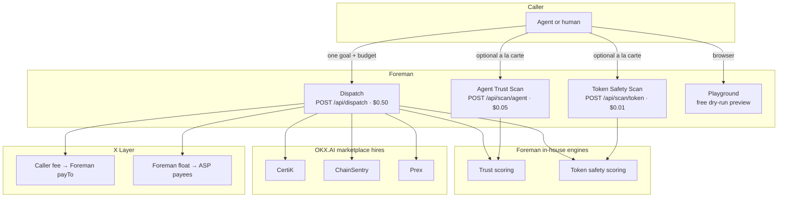
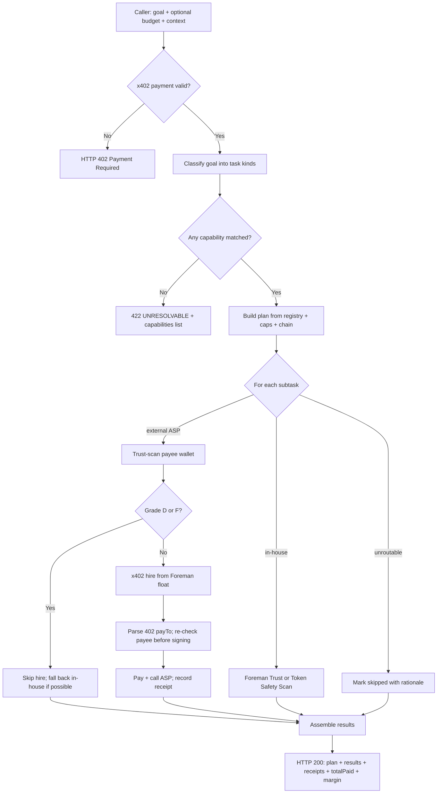
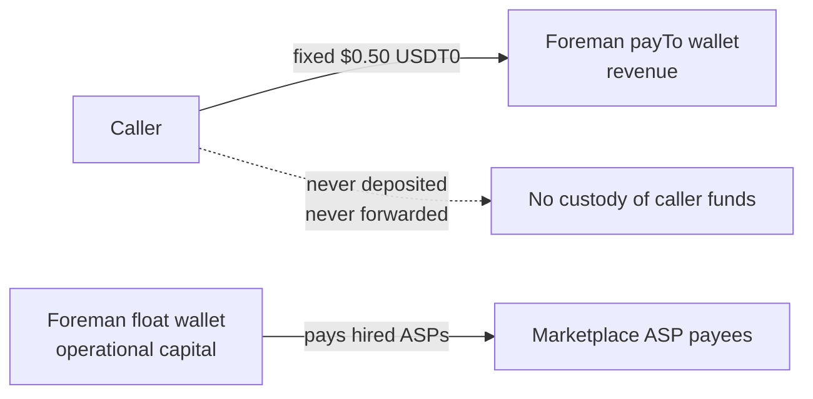
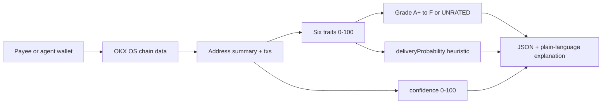
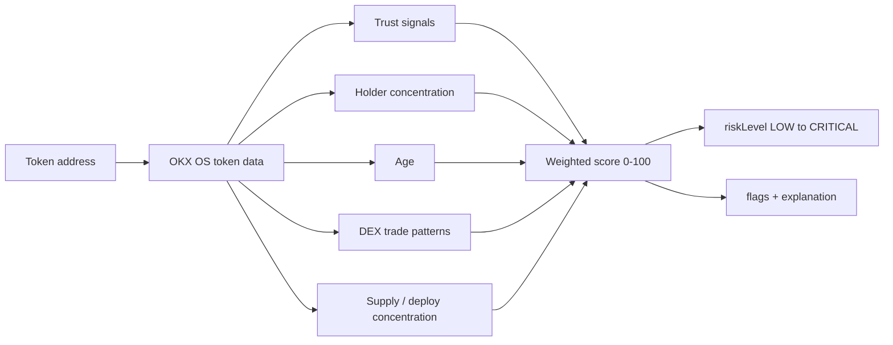
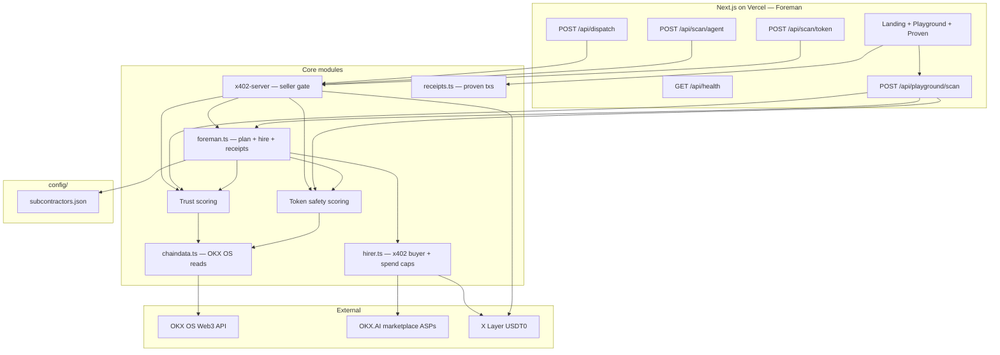

# Foreman

**The employer of the agent economy.**

<p align="center">
  
</p>

<p align="center">
  <strong>One goal. One budget. Verified hires. Onchain receipts.</strong><br/>
  <a href="https://agentdnas.vercel.app">Live product</a>
  ·
  <a href="https://agentdnas.vercel.app/llms.txt">llms.txt</a>
  ·
  X Layer (<code>eip155:196</code>)
  ·
  MIT
</p>

---

## Judge path (60 seconds)

| Question | Answer |
| --- | --- |
| **What is Foreman?** | An A2MCP employer on OKX.AI. You send one job; Foreman plans it, hires marketplace agents, trust-checks each payee, pays them in USDT0, and returns results plus receipts. |
| **Why hire Foreman?** | In an open agent marketplace, **hiring is the hard part**: who can do the work, are they trustworthy, how do you pay, and where is the paper trail? |
| **Flagship call** | `POST /api/dispatch` at **$0.50** USDT0. Unpaid calls return **HTTP 402** (x402). |
| **Where is money?** | Callers pay a **fixed fee** to Foreman. Downstream ASP hires are paid from Foreman’s **own float**. Caller funds are **never held or moved**. |
| **How does Foreman trust a hire?** | Before every paid hire, Foreman trust-scans the wallet that will receive funds. Grades **D** and **F** are blocked. |
| **Try without a wallet?** | Yes: the [live playground](https://agentdnas.vercel.app/#playground) (same-origin, rate limited). Dispatch previews are always dry-run. |
| **Is settlement real?** | Yes. The site’s **Proven onchain** section links real X Layer USDT0 transactions. |

You do not orchestrate a swarm yourself. **You hire Foreman.**

---

## What Foreman is

**Foreman** is an Agent Service Provider (A2MCP) on the [OKX.AI](https://www.okx.com/) marketplace. Other agents (or humans) pay once, state a job in plain language, and get back:

1. A **plan** of concrete subtasks
2. **Results** from Foreman’s own scans and/or hired marketplace ASPs
3. A full **receipt trail** (amounts, settlement status, trust checks, tx hashes when paid)

Every paid **Dispatch** run:

```text
plan  →  hire  →  trust-scan payee  →  pay from float  →  assemble results + receipts
```

The same engines Foreman uses to gate hires are also sold a la carte:

- **Agent Trust Scan** — counterparty / wallet reputation before you hire anyone
- **Token Safety Scan** — structural token risk before a swap or LP

Those two are supporting products. **Dispatch is the product.**

---

## Product at a glance

Settlement: **x402** exact scheme, **USDT0** on **X Layer**. No negotiation. No escrow wait for A2MCP.

| Service | Endpoint | Price | Role |
| --- | --- | --- | --- |
| **Foreman Dispatch** | `POST /api/dispatch` | **$0.50** USDT0 | **Flagship.** Plan, hire, verify, pay, deliver + receipts |
| **Agent Trust Scan** | `POST /api/scan/agent` | **$0.05** USDT0 | Foreman’s hiring standard, also callable alone |
| **Token Safety Scan** | `POST /api/scan/token` | **$0.01** USDT0 | Foreman’s token gate, also callable alone |

Also free:

| Surface | Endpoint | Purpose |
| --- | --- | --- |
| Health | `GET /api/health` | Status, version, `demoMode` |
| Playground API | `POST /api/playground/scan` | Browser-only free preview (rate limited) |
| Agent map | `GET /llms.txt` | Machine-readable site map for agents |
| Marketing UI | `/` | Playground, proven txs, API copy |

---

## Why Foreman exists

| Problem | Without Foreman | With Foreman |
| --- | --- | --- |
| Finding who can do the work | Manual search and prompt glue | Deterministic taxonomy + curated ASP registry |
| Trust before payment | Hope the counterparty is honest | Built-in trust scan (blocks D / F) |
| Token or counterparty risk | Separate tools, separate payments | Scans built into Dispatch, also sold alone |
| Settlement trail | Scattered invoices | One job, one receipt table |
| Custody | Agents hold or move your funds | **Foreman never holds caller funds** |
| Multi-step goals | Caller orchestrates N payments | One fixed inbound fee; Foreman pays the rest from float |

---

## Big picture

```text
                    YOU (agent or human)
                              |
                              |  pay $0.50 USDT0 via x402
                              |  POST /api/dispatch  { goal, budget?, context? }
                              v
                    +-------------------+
                    |     FOREMAN       |
                    |                   |
                    |  1. Classify goal |
                    |  2. Build plan    |
                    |  3. Hire / scan   |
                    |  4. Trust gate    |
                    |  5. Pay + collect |
                    |  6. Return all    |
                    +---------+---------+
                              |
           +------------------+------------------+
           |                  |                  |
           v                  v                  v
    Foreman in-house     Marketplace ASPs     X Layer USDT0
    Trust Scan           CertiK, ChainSentry, settlement
    Token Safety         Prex, ...            (inbound + float)
```



---

## Foreman Dispatch

### End-to-end flow



### What goals Foreman can take on

The planner is **deterministic** (no LLM). Goal text is matched against a fixed taxonomy:

| Kind | Example phrases | Typical route |
| --- | --- | --- |
| **Token risk** | honeypot, rug pull, token safety / scan / risk | Marketplace ASP if chain fits caps; else **Foreman Token Safety Scan** (X Layer) |
| **Counterparty diligence** | reputation, vet agent/wallet, trust check | Always **Foreman Agent Trust Scan** |
| **Prediction market** | Polymarket, Kalshi, odds, forecast | Marketplace ASP (Prex preferred) |
| **Security check** | audit, CertiK, vulnerability | CertiK if chain fits; else Foreman Trust Scan fallback |

If the goal does not match anything Foreman offers, the response is a clean **422** with the capability list. No fake work.

### Request shape

```json
{
  "goal": "Check token risk for 0x... on bsc and due diligence on agent 0x...",
  "budget": 0.35,
  "context": {
    "tokenAddress": "0x...",
    "agentAddress": "0x...",
    "contractAddress": "0x...",
    "chain": "bsc",
    "marketId": "optional",
    "addresses": ["0x..."]
  }
}
```

- **goal** (required): plain language, max 2000 characters
- **budget** (optional): max downstream spend in USDT0 (hard-capped; default max **0.35**)
- **context** (optional): structured addresses / chain / market id when goal text alone is ambiguous

### Response shape

```json
{
  "scan": "dispatch",
  "goal": "...",
  "plan": {
    "budgetUsdt0": "0.35",
    "subtasks": [
      {
        "kind": "token_risk",
        "title": "Token risk check",
        "route": "external",
        "provider": "ChainSentry (Token DD Verdict)",
        "priceUsdt0": "0.05",
        "targetAddress": "0x...",
        "providerChain": "bsc",
        "rationale": "..."
      }
    ],
    "notes": []
  },
  "results": [
    {
      "kind": "token_risk",
      "title": "Token risk check",
      "provider": "...",
      "status": "ok",
      "summary": "...",
      "data": {}
    }
  ],
  "receipts": [
    {
      "subcontractor": "...",
      "endpoint": "https://...",
      "amountUsdt0": "0.05",
      "txHash": "0x...",
      "settlementStatus": "success",
      "trustCheck": {
        "status": "passed",
        "grade": "C",
        "deliveryProbability": 62,
        "payee": "0x..."
      },
      "durationMs": 1200,
      "dryRun": false
    }
  ],
  "totalPaid": "0.05",
  "margin": "0.45",
  "dryRun": false,
  "explanation": "...",
  "scannedAt": "2026-07-20T12:00:00.000Z",
  "version": "1.0.0"
}
```

- **totalPaid**: sum of downstream hire amounts (from Foreman’s float)
- **margin**: inbound fee minus totalPaid (Dispatch fee is revenue; remainder after hires)

### Spend caps (defaults)

| Cap | Default | Meaning |
| --- | --- | --- |
| Per subcall | **$0.10** | Max paid to any single hired ASP |
| Per job | **$0.35** | Max total float spent on one Dispatch |
| Per day | **$5.00** | Rolling UTC-day float ceiling |

Inbound fee stays **$0.50** fixed. At most **$0.35** of that is available for downstream hires; the rest is margin. Caps are env-overridable; Foreman never silently exceeds them.

### Chain resolution

- Explicit `context.chain` wins when present
- Otherwise first anchored mention in the goal (`on bsc`, `chain ethereum`, `bsc chain`)
- Aliases normalized (`eth` / `ethereum`, `bnb` / `bsc`, …)
- Provider-specific spelling is sent to each ASP (e.g. CertiK wants `eth`, not `ethereum`)

---

## Custody model (non-negotiable)



| Flow | Wallet | Who funds it |
| --- | --- | --- |
| Inbound Dispatch / scan fee | Foreman **payTo** address | The **caller** (per call via x402) |
| Downstream ASP hires | Foreman **float** private key | **Operator** funds the float offline |

Callers never send a private key, never deposit into Foreman, never fund the float. Only Foreman’s own USDT0 moves to hired ASPs.

---

## Foreman’s hiring standard

Before Foreman pays anyone on the marketplace, it trust-scans the wallet that will receive funds. The same scan is sold alone as **Agent Trust Scan** (`POST /api/scan/agent`).

Scoring is **pure and deterministic** (no LLM). Inputs are onchain history from OKX OS on X Layer (~6 month history window).



### Six behavioral traits

| Trait | What it measures | Why Foreman cares before paying |
| --- | --- | --- |
| **Reliability** | Success vs failed txs (recent activity weighted more) | Does this address complete activity cleanly? |
| **Consistency** | Regular cadence vs long dormancy then bursts | Is behavior stable? |
| **Longevity** | Wallet age (log-scaled; window-aware) | Established actor vs brand-new throwaway? |
| **Risk appetite** | Unverified/new counterparties + value concentration | How aggressive is the onchain footprint? (descriptive) |
| **Activity** | Recent volume and cadence relative to age | Is the wallet actually used? |
| **Counterparty diversity** | Unique peers relative to tx count | One-peer patterns vs diversified interaction |

### Outputs

| Field | Meaning |
| --- | --- |
| `traits` | Six scores, each 0–100 |
| `grade` | A+ through F; **UNRATED** when confidence &lt; 15 (thin history is not dressed up as a fake A) |
| `deliveryProbability` | Heuristic blend of reliability + consistency + longevity; labeled **heuristic estimate**, not a guarantee |
| `confidence` | How much history the data window actually supports |
| `explanation` | Short plain-language summary |

### Gate rules (every external hire)

1. Trust-scan the **registry payee** (hint)
2. On the live **402 challenge**, re-check the **actual payTo** address (binding check)
3. Grades **D** and **F** → hire blocked; in-house fallback when available
4. **UNRATED** → allowed with caution (low history, not an automatic fail)
5. Scan unavailable → hire may proceed without verification (recorded on the receipt)

---

## Token Safety Scan (Foreman’s token gate)

Used inside Dispatch for token-risk subtasks on X Layer, and sold alone at `POST /api/scan/token`.



| Component | Weight | Signal |
| --- | --- | --- |
| Trust | 20% | Honeypot tag, risk-control level, community recognition |
| Holders | 30% | Top-10 concentration |
| Age | 20% | Token age (older scores safer for this heuristic) |
| Trades | 20% | DEX flow: diversity, one-sidedness, dominant trader |
| Supply | 10% | Top-holder / developer concentration |

| Output | Meaning |
| --- | --- |
| `score` | 0–100 safety score |
| `riskLevel` | LOW (≥75), MEDIUM (≥55), HIGH (≥35), CRITICAL (&lt;35) |
| `flags` | Plain-language red reasons (honeypot, concentration, young token, one-sided flow, …) |
| `confidence` | How complete the upstream data was |
| `explanation` | Short natural-language summary |

---

## Who Foreman hires

Hires come from Foreman’s **curated registry** (`config/subcontractors.json`), not live marketplace search at request time. That keeps routing deterministic and price-bounded.

| ASP | Capability | Default price | Notes |
| --- | --- | --- | --- |
| **CertiK** | Security check | 0.001 USDT0 | Multi-chain token security; chain spelling is provider-specific |
| **ChainSentry** | Token risk | 0.05 USDT0 | BUY / CAUTION / BLOCK style verdict when chain is supported |
| **Prex** | Prediction market | 0.01 USDT0 | Direction / confidence style market analysis |
| **Prediction Market Eye** | Prediction market | 0.20 USDT0 | Only hired if the per-subcall cap is raised above 0.10 |

Foreman’s hirer refuses any 402 challenge **above the registry quote**, requires **HTTPS**, blocks private hosts, times out subcalls, and retries once on transient failure.

---

## Website and free playground

Live: [https://agentdnas.vercel.app](https://agentdnas.vercel.app)

| Section | Purpose |
| --- | --- |
| Hero | Foreman pitch for humans and judges |
| **Playground** | Preview Dispatch (dry-run), Trust Scan, or Token Safety Scan |
| **Proven onchain** | Real settled Dispatch + hire txs with explorer links |
| **How agents call this** | Prices, curl examples, copy buttons |

Playground rules (abuse control):

- Same-origin browser requests only
- **10 requests per hour per IP** (per Vercel isolate)
- **No x402** on this path
- Dispatch always runs with **forced dry-run** (never spends Foreman’s float from the marketing site)
- Production agents pay the real `/api/dispatch` and `/api/scan/*` routes

---

## Architecture



| Layer | Role |
| --- | --- |
| `app/api/*` | Thin HTTP: validation, rate limits, x402 gate |
| `lib/foreman.ts` | Dispatch engine: taxonomy, plan, hire, receipts |
| `lib/hirer.ts` | Buyer: 402 challenge, EIP-3009 sign, spend caps, payee gate |
| Trust / token modules | Pure scoring (deterministic, unit-tested) |
| `lib/chaindata.ts` | Signed OKX OS chain reads |
| `lib/x402-server.ts` | Seller-side payment middleware |
| `config/subcontractors.json` | Curated hire targets |
| `components/*` | Playground, radar, proven onchain, API docs UI |

**Stateless by design.** No VPS. No long-lived worker. In-memory rate limits and day ledgers are per serverless isolate (documented; per-job caps still bound any single request).

---

## Payment (x402)

| Rule | Detail |
| --- | --- |
| Scheme | x402 **exact** |
| Network | X Layer `eip155:196` |
| Asset | USDT0 `0x779Ded0c9e1022225f8E0630b35a9b54bE713736` |
| Unpaid call | **HTTP 402** with accept metadata |
| Headers | `PAYMENT-SIGNATURE` / `X-PAYMENT` / `Authorization: Payment ...` |
| Demo | `DEMO_MODE=true` bypasses inbound payment (local / demos only) |
| Wiring failure | **503** with stage detail (never silent empty 500) |

---

## API quick start

Base URL: `https://agentdnas.vercel.app`

### Foreman Dispatch (flagship)

```bash
curl -s -X POST https://agentdnas.vercel.app/api/dispatch \
  -H "Content-Type: application/json" \
  -d '{
    "goal": "Check token risk for 0x... on bsc and due diligence on agent 0x...",
    "budget": 0.35,
    "context": { "tokenAddress": "0x...", "agentAddress": "0x...", "chain": "bsc" }
  }'
```

### Agent Trust Scan (a la carte)

```bash
curl -s -X POST https://agentdnas.vercel.app/api/scan/agent \
  -H "Content-Type: application/json" \
  -d '{"address":"0x..."}'
```

### Token Safety Scan (a la carte)

```bash
curl -s -X POST https://agentdnas.vercel.app/api/scan/token \
  -H "Content-Type: application/json" \
  -d '{"address":"0x..."}'
```

### Health

```bash
curl -s https://agentdnas.vercel.app/api/health
```

Unpaid production calls return **402**. Agents settle with the OKX Payment SDK.

---

## Security posture

| Control | Behavior |
| --- | --- |
| Secrets | Env only (`.env.local` / Vercel). Never in source |
| Inbound auth | x402 payment proof (or `DEMO_MODE` for local only) |
| Outbound spend | Double-enforced caps + day ledger |
| Price integrity | Hirer refuses challenges above the registry quote |
| Payee integrity | Trust gate on challenge `payTo`, not only registry hint |
| Endpoint guard | HTTPS only; private hosts blocked |
| Playground | Same-origin + rate limit; Dispatch forced dry-run |
| Failures | Typed error codes; wiring failures named by stage |

Report settlement / custody issues privately rather than filing a public issue with secrets.

---

## Local development

```bash
git clone https://github.com/rudazy/AgentDNA.git
cd AgentDNA
cp .env.example .env.local
# Fill OKXOS_* for live chain data.
# Keep DEMO_MODE=true and FOREMAN_DRY_RUN=true locally.
npm install
npm run dev
```

Open [http://localhost:3000](http://localhost:3000).

| Command | Purpose |
| --- | --- |
| `npm run dev` | Local development server |
| `npm run build` | Production build (regenerates `public/llms.txt`) |
| `npm test` | Vitest unit suite |
| `npm run typecheck` | `tsc --noEmit` |

Operator checklist (float wallet, Vercel env, smokes): [`.env.example`](.env.example) and [`RUNBOOK.md`](RUNBOOK.md).

---

## Repository layout

```text
app/                 Foreman landing page, metadata, API routes
components/          Playground, trust radar, proven onchain, motion
config/              Subcontractor registry (hire targets)
docs/                Listing copy, pricing notes, demo script, brand assets
lib/                 Dispatch engine, hirer, trust/token scoring, x402, chain data
public/llms.txt      Machine-readable site map for agents
scripts/             Env checks, llms generation, smokes, paid-dispatch recorder
```

Internal working notes under `tasks/` are **gitignored** and never published.

---

## Documentation

| Doc | Audience |
| --- | --- |
| [RUNBOOK.md](RUNBOOK.md) | Operators: env, deploy, float wallet, smoke tests |
| [docs/listing.md](docs/listing.md) | Marketplace listing and service field copy |
| [docs/pricing.md](docs/pricing.md) | Pricing rationale |
| [docs/demo-script.md](docs/demo-script.md) | Live demo walkthrough |
| [public/llms.txt](public/llms.txt) | Agent-oriented site map |

---

## License

[MIT](LICENSE) · Built by **Ludarep** ([@rudazy](https://github.com/rudazy))

---

<details>
<summary>Repo name note</summary>

The public product is **Foreman**. The GitHub repo path and some internal package fields still use the earlier working name **AgentDNA** / `agent-dna`. Marketplace service names are **Foreman Dispatch**, **Agent Trust Scan**, and **Token Safety Scan**.
</details>
